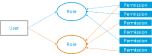
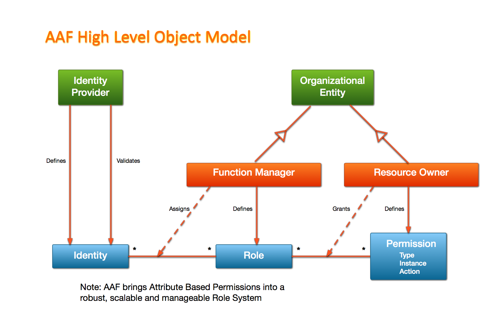
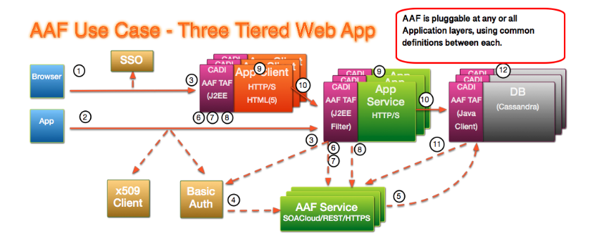

.. This work is licensed under a Creative Commons Attribution 4.0 International License.
.. http://creativecommons.org/licenses/by/4.0
.. Copyright © 2017 AT&T Intellectual Property. All rights reserved.
.. _master_index:

AAF - Application Authorization Framework
==================================================
.. image:: https://bestpractices.coreinfrastructure.org/projects/2303/badge 
  :alt: CII Silver Badge 
  :target: https://bestpractices.coreinfrastructure.org/projects/2303

.. The purpose of AAF (Application Authorization Framework) is to organize software authorizations so that applications, tools and services can match the access needed to perform job functions.

AAF is designed to cover Fine-Grained Authorization, meaning that the Authorizations provided are able to used an Application's detailed authorizations, such as whether a user may be on a particular page, or has access to a particular Pub-SUB topic controlled within the App.

This is a critical function for Cloud environments, as Services need to be able to be installed and running in a very short time, and should not be encumbered with local configurations of Users, Permissions and Passwords.

To be effective during a computer transaction, Security must not only be secure, but very fast. Given that each transaction must be checked and validated for Authorization and Authentication, it is critical that all elements on this path perform optimally.

Sections
++++++++

.. toctree::
   :maxdepth: 1
   :glob:

   sections/architecture/index
   sections/installation/index
   sections/configuration/index
   sections/development/index
   sections/AAF_in_a_Nutshell
   sections/logging
   sections/release-notes

Introduction
------------
AAF acronym stands for Application Authorization Framework and initially it was focused on  “Authorization”, but now supports implementations for both Authentication and Authorization. AAF is a set of Client Libraries (CADI Framework) and RESTful Services that support multiple Authentication Protocols and Fine-Grained Authorization.
The goal of AAF project is to provide consistent authentication, authorization and security to various ONAP components. AAF organizes software authorizations so that applications, tools and services can match the access needed to perform job functions. AAF is designed to cover Fine-Grained Authorization, meaning that the Authorizations provided are able to use an Application's detailed authorizations, such as whether a user may be on a particular page, or has access to a particular Pub-Sub topic controlled within the App. This is a critical function for Cloud environments, as Services need to be able to be installed and running in a very short time, and should not be encumbered with local configurations of Users, Permissions and Passwords. The sister framework CADI (Code Access Data Identity) allows Java Applications to utilize Identity Authentication methods as plugins. Certificate Manager delivers X509 certificates in support of 2 way x509 TLS.

AAF contains some elements of Role Based Authorization, but includes Attribute Based Authorization elements as well.

Entities within AAF
-------------------

AAF is an IAM that organizes software authorizations so that applications, tools and services can match the access needed to perform job functions. AAF is more than a typical RBAC. There are Roles, to be sure, but the important Architectural Pattern includes separation of Roles and Permissions. 

|image0|

A permission is composed of the following attributes:

* Type: core name of the permission
* Instance: the object that is being interacted
* Action: What is happening with this object

All roles, permissions identities of a given module in ONAP is covered by a Namespace (e.g. roles, permission and identities for the APP-C modules of ONAP)

The permissions, having a 3 part definition, make AAF also like an ABAC (A=Attribute).
Roles, Permissions are stored centrally, but segregated by Application (the proverbial Namespace). The Application Creates Permissions that match their code (for the question "Does User have Permission"). Permissions are granted to Roles, to which the User belongs. AAF is not a Policy Engine, where dynamically based Policies are validated against differing kinds of Data Stores. AAF (Application Authorization Framework) is focused on RealTime Authentication and Authorization. 

Namespace
^^^^^^^^^
A Namespace, in AAF, is the ensemble of Roles, Permissions and Identities. Namespaces are known by domain, example com.onap.dcae or com.onap.appc and they are hierarchically managed. A Namespace is assigned to an application and contains one or more roles and one or more permissions. By default, every namespace has an admin role

**People in Namespaces**

Tasks Owner (Responsible) must do:

* Owners receive by email a notification to Approve
* Owners also receive notifications of time based activities

   * Periodic Revalidation of Users in Roles in Namespace
   * Periodic Revalidation of Permission in Namespace to Roles

Admins may:

* Create/Delete/Modify Roles in Namespace
* Add/Remove Users from Roles in Namespace
* Create/Delete/Modify Permissions in Namespace
* Grant/Ungrant Permissions in Namespace to any Role in the company (Cross Company Role Grants are possible, but require approvals from both sides).

Only Namespace Admins may manage Roles/Permissions within a Namespace. The Granting process is One-Way. The Namespace Admins must Grant given Permissions to Roles on request.

Object Model
^^^^^^^^^^^^

|image1|

Resource Owner in ONAP defines permissions:

* He defines and grants permission to roles 
* Get notified by a mail when an Identity with a Role asks to be granted a permission

Essential Components
--------------------
The core component to deliver this Enterprise Access is a RESTful service, with runtime instances registered in a Cloud Directory (DME2) and backed by a resilient Datastore (Cassandra as of release 1.3)

The Data is managed by RESTful API, with Admin functions supplemented by Character Based User interface and certain GUI elements.

CADI Framework
^^^^^^^^^^^^^^

CADI is a framework for providing Enterprise Class Authentication and Authorization with minimal configuration to Containers and Standalone Services
It is in fact a library used by services to:

* Authenticate with one or more Authentication Protocols 
* Authorize in a FINE-GRAINED manner using AAF Components

AAF Components – RESTful Services
^^^^^^^^^^^^^^^^^^^^^^^^^^^^^^^^^

Service (primary) – All the Authorization information, it is accessible by provided Caching Clients and by specialized plugins:

* Locate – how to find ANY OR ALL AAF instances across any geographic distribution
* OAuth 2.0 – new component providing Tokens and Introspection
* GUI – Tool to view and manage Authorization Information, and create Credentials
* Certman – Certificate Manger, create and renew X509 with Fine-Grained Identity
* FS – File Server to provide access to distributable elements (like well known certs)
* Hello - Test your client access (certs, OAuth 2.0, etc.)

Cassandra as global replicating Data Store
^^^^^^^^^^^^^^^^^^^^^^^^^^^^^^^^^^^^^^^^^^

How AAF works
---------------------
To understand how AAF works, let's describe its workflow through a high level "three tiered web app" use case:

|image2|

1. Browser client goes to GUI using for instance SSO plugin (or Basic Auth)
2. App goes directly to a Service using x509 or Basic Auth (or other)
3. CADI Filter coverts credential to “Principal”. If not in cache, AAF is contacted for Permissions protecting GUI with Service ID/Credential (MechID of App/Pass or X.509 Client Cert (preferred)).
4. AAF does provide User/Password features, or can be delegated to other credential service via Plugin
5. If information is not in Service Cache, AAF’s DB is contacted using AAF Service ID/Credential.
6. Client App uses Permission Attributes delivered by AAF/AAF Cache for protecting sensitive data/functions (using J2EE method).
7. If not in Cache, Client contacts App Service, using App ID/Credential.
8. CADI Filter converts App ID/Credential to Principal. If not in cache, contacts with AAF (with App ID/Credential) for Permissions of Client.
9. App protects data based on Client Permissions.
10. Component contacts next layer using Service ID/Credential.
11. If ID or Permissions of AppServer are not in Cache, contact AAF using AAF Security Plugin for Cassandra, which uses AAF Java Client.
12. Cassandra protects Cluster/Keyspace/ColumnFamily w/Permissions.   

