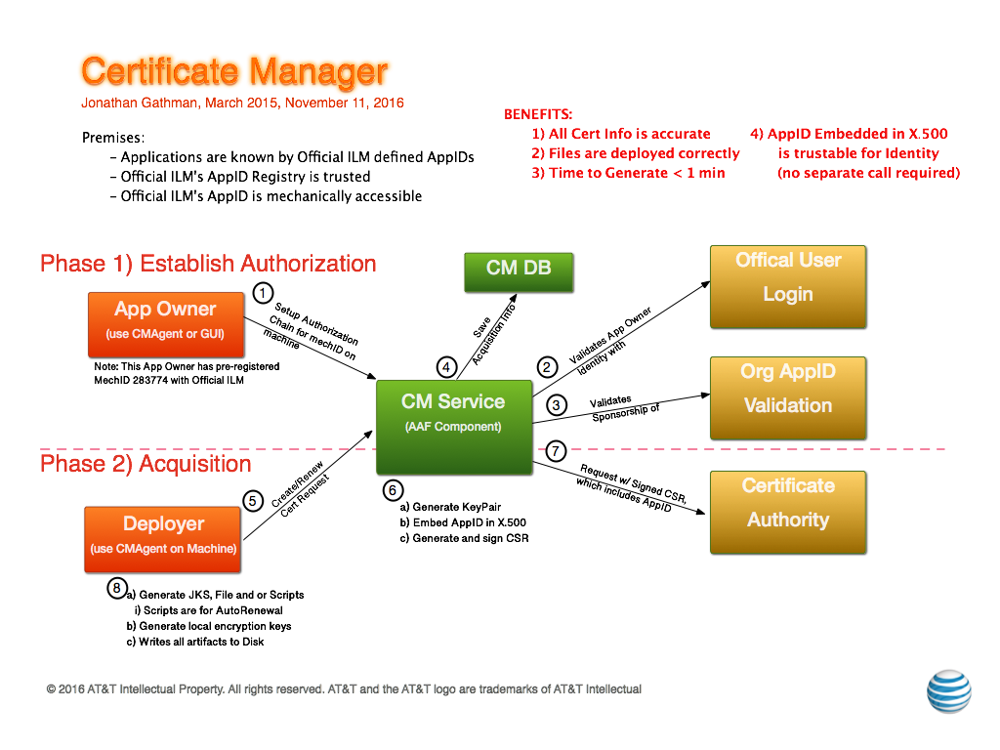

.. This work is licensed under a Creative Commons Attribution 4.0 International License.
.. http://creativecommons.org/licenses/by/4.0
.. Copyright © 2017 AT&T Intellectual Property. All rights reserved.

AAF Architecture
================
AAF is designed to cover Fine-Grained Authorization, meaning that the Authorizations provided are able to used an Application’s detailed authorizations, such as whether a user may be on a particular page, or has access to a particular Pub-SUB topic controlled within the App.

This is a critical function for Cloud environments, as Services need to be able to be installed and running in a very short time, and should not be encumbered with local configurations of Users, Permissions and Passwords.

To be effective during a computer transaction, Security must not only be secure, but very fast. Given that each transaction must be checked and validated for Authorization and Authentication, it is critical that all elements on this path perform optimally.

|image0|

.. |image0| image:: images/aaf-hl-object-model.png
   :height: 600px
   :width: 800px

Philosophy of Identity
======================

It may seem out of place to use the word "Philosophy" in a technical document, but given that philosophy is the study of knowledge, reality and existence, perhaps it is not so strange after all.  When you combine this with the fact that the stereotypical "computer guy" also spends a lot of time reading/watching Science Fiction, then perhaps it is extraordinarily appropriate instead.

In security, the two main tasks are to establish the validity to a claim of Identity (Authentication), and subsequently to relay what that Identity may do in certain contexts (Authorization).

What is Identity?
-----------------

Fundamentally, Identity is the direct association of a name to some object, person or concept.  The goal of naming is to make a consistent reference point to the same object, person or concept, and be able to share that via communications betwween a community.  Thus, in a conversation, someone might bring up the name Charles de Gaulle in conversation, and the person and work of the French Minister of Armed Forces in France should come to mind.  There is an anchor point in the minds of both persons while discussing this person.  Even if one of the parties knows little about Charles de Gaulle, it becomes an anchor point to start gathering information, and can be returned to in future converstations.

"Person and work" are polite ways of referring to people, who they are (or were), and what they do (or did).  We will be more succint, and refer to Identity and Function, and apply this in the context of an Organization.

Identity in Context
-------------------

A common experience for most people is "getting a job".  Upon acceptance, the new person is added to company records, and assigned certain unique names so that the money you receive can be in direct association to the work you accomplish.  The same is true for Schools, volunteer organizations.  The existing Organization assigns this name, typically known as an "ID".  It may or may not be created with any other names in it, but it associated with other names in records.  Even when you are born, you are born into a family, and the parents choose the name, and record it within the country (Birth Certificate).  

Thus, the key element is that the Organization itself, delegated by the ultimate Authority of that Organiaztion, determines the name that you will use in Context.  That name remains throughout the association with that Organization.  Even if your ID is changed, that is usually recorded, so that records can be associated with past and present records.

Computer Identity
-----------------

Whether or not you follow Science Fiction stories about Robots, are fascinated by Isaac Azimov's Three Laws of Robotics, or think those who do are hopelessly socially inept, you will need to wrestle a bit with how much in common a human created machine has with a human being.  Without moral or religious implications, Identity can be discussed without stepping on the minefields that Science Fiction typically explores.

An Application still must be named, and the name must be controlled within the Context of the Organization defining the name.  Where the Application can affect Organzation Resources (i.e. Data), it must have the Authorization to do what it is doing, the question of being sentiently driven need not come up.  (sorry sci-fi fans).

Therefore, from an Organization Context, the very same Authentication and Authorization questions apply whether the Identity in question is "Carbon Based Life Form" or "Silicon Based Life Form".

Sum of Parts
------------

For a human, it is pretty clear, of our purposes, that it is the mind that focuses into Identity.  Any given Employee might lose an arm or leg during the period of employment, and, as long as they can type or vocalize a voice-print, there is usually no doubt that the person is still the person.

Computer Applications may be different.  Typically, an Application is built of separate parts, and with the advent of MicroServices as a goal, the question whether each part needs a separate identity or not is actually a valid question.  When a Programmer is writing his App, and making the parts, he/she must decide if these parts need to stand on their own as an Identity or not.

The trick is, as an Architect, is to determine whether these individual components really are separate, or can be considered as a part of the whole.

As a rule of thumb, look at your App.  If you follow a Model-View-Controller method, it is hard to argue for a need to separate identities... They are clearly three parts to the whole. On the other hand, if you want to consider each Component as a separate Robot, where one may NOT do just anything that the others do, then you should create separate Identities for each.  

A clue to this kind of model is if you consider having different groups creating an managing the apps, with a view towards more separateness. If you believe your components are more separate, and the grouping is more by topic (i.e. a group of robots tasked with collectively doing something), the separate Identities may be more appropriate.

Enjoy stretching your mind
--------------------------

AAF can support models of either side.  In the meantime, enjoy the use of your mind to comtemplate things beyond tickets and this will help drive what you need to ask for in terms of Identities for your Apps.

Components
==========

The running components of AAF include the following:
 - "service" - RESTful HTTP/S - The main API Service for Authentication, Authorization and Management
 - "locate" - RESTful HTTP/S - Provides Scaleble, Cross-Deployment Global location, inside or outside a container, of Registered Components (at minimum, AAF Components).  Locate also provide Configuration information for Generated Configurations.
 - "oauth" - RESTful HTTP/S - OAuth 2 implementation.  Provides "token" and "introspection" methods, where Authorization data is included.
 - "gui" - Browser HTTP/S - Management GUI, where user interactions occur, including a Web-based CMD-Line interface, API Docs, Approval pages, etc.
 - "cm" - RESTful HTTP/S - Certificate Manager API, see more details below.
 - "fs" - HTTP ONLY - File Server.  This Component MUST NOT be HTTP/S, because it Provides HTTP Accessed RCLs as part of the TLS process.  Other public information may be presented as well (such as Certificates, which are by definition Public)

Certificate Manager
===================

Overview
--------
Every secure transaction requires 1) Encryption 2) Authentication 3) Authorization.  

 - HTTP/S provides the core Encryption whenever used, so all of AAF Components require HTTP/S to the current protocol standards (current is TLS 1.1+ as of Nov 2016)
 - HTTP/S requires X.509 certificates at least on the Server at minimum. (in this mode, 1 way, a client Certificate is generated)
 - Certificate Manager can generate certificates signed by the AT&T Internal Certificate Authority, which is secure and cost effective if external access is not needed
 - These same certificates can be used for identifying the Application during the HTTP/S transaction, making a separate UserID/Password unnecessary for Authentication.
 - Authentication - In order to tie generated certificates to a specific Application Identity, AAF Certificate Manager embeds a ILM AppID in the Subject.  These are created by AT&T specific Internal Certificate Authority, which only generates certificates for AAF Certman.  Since AAF Certman validates the Sponsorship of the AppID with requests (automatically), the end user can depend on the AppID embedded in the Subject to be valid without resorting to external calls or passwords.

 - ex:
   - Authorization - AAF Certman utilizes AAF's Fine-grained authorizations to ensure that only the right entities perform functions, thus ensuring the integrity of the entire Certificate Process

|image1|

