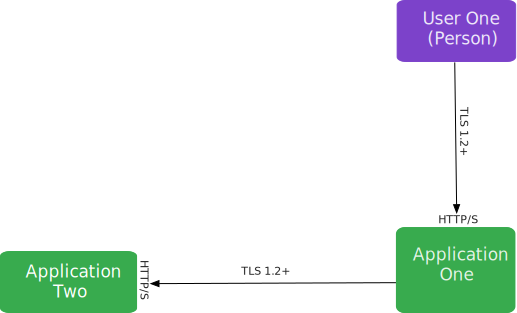
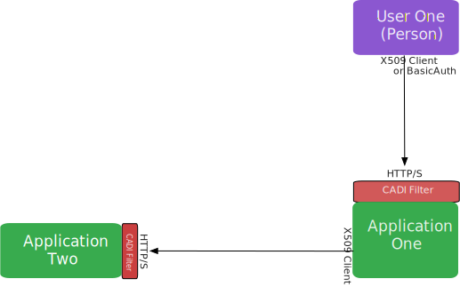
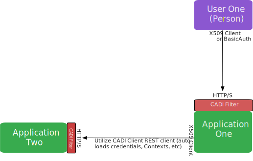
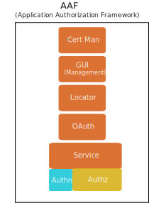
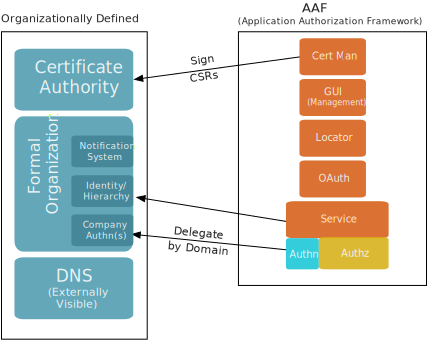
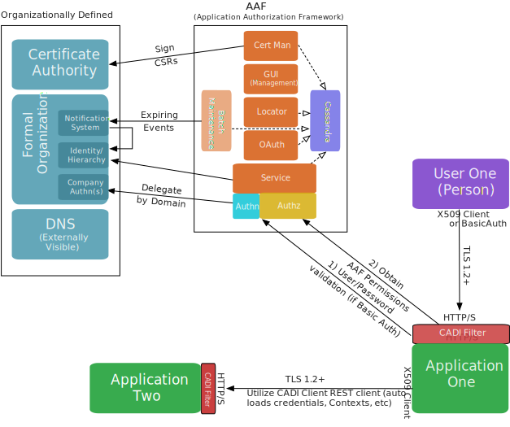

.. This work is licensed under a Creative Commons Attribution 4.0 International License.
.. http://creativecommons.org/licenses/by/4.0
.. Copyright © 2017 AT&T Intellectual Property. All rights reserved.

Security Architecture
=====================
Communicating
-------------
When one compute process needs to communicate to another, it does so with networking.

The service side is always compute process, but the client can be of two types:
 * People (via browser, or perhaps command line tool)
 * Compute process talking to another computer process.

In larger systems, it is a typical to have just one connection, but will the call initiated by the initial actor will cause additional calls after it.  Thus, we demonstrate both a client call, and a subsequent call in the following:

Thus, the essential building blocks of any networked system is made up of a caller and any subsquent calls.

Communicating *Securely*
------------------------
Whenever two processing entities exist that need to communicate securely, it is *essential* that 
 * The communications between the two are encrypted
 * The identities of the caller and callee are established (authentication)
 * The caller must be allowed to do what it is asking to do (authorization)

**Encryption**

Encryption is provided by HTTP/S with the TLS 1.2+ protocol. Lesser protocols can also be added, but it is highly recommended that the protocol go no lower than TLS 1.1

ALL components of AAF are accessible only by HTTP/S (service, locate, oauth, gui, certman), EXCEPT the component "FS".  

FS *must* be HTTP, because it is responsible for being accessible DURING the TLS process for recent RCLs.  (Revocation lists).  Since it is part of the TLS process, it cannot be TLS itself.

**Establishing Identity**

*Client Side*

In order to be secure of the Server Identity, the client will:
 * Carefully select the Endpoint for the server (URL)
 * The Service side Certificate chain obtained by TLS must ultimately be signed by a Certificate Authority that is trusted.

*Server Side*

The server side is a little harder to accomplish, because, while a client can choose carefully whom he contacts, the server, ultimately, might be contacted by literally anyone.

To solve this difficult problem, the CADI Framework Filter is attached to the incoming transaction before any code by Application 1 or Application 2 is invoked. The CADI Framework does the following:
 A) Establishes the claimed Identity (this differs by Protocol)

   i) The Identity needs to be a Fully Qualified Identity (FQI), meaning it has

    #) An ID approved by Organization (such as bob)
    #) A Domain establishing where the Credential is defined (ex: @bobs.garage.com)
    #) FQI Example: bob@bobs.garage.com

 B) Validates the credential of the FQI ( *Authentication* )

   i) Basic Auth (User/Password) is validated against the system supporting the domain
   ii) AAF Certman can create a fine-grained X509 certificate, which can derive FQI
   iii) If the FQI fails the Credential test in any way, the transaction is terminated

 C) Obtain *Authorization* information

   i) This might include a call to AAF which will return all the Permissions of the User per Application Context
   ii) This might involve pulling these from Cache
   iii) This also might be pulled from Token

Enabling the Client to Send Securely
------------------------------------

Once a secure scenario is in place, the client must provide more information, or he will be rejected by the secured server.

 * FQI (Fully Qualified Identity)
 * Credential
   * If User/Password, then the client must send via "BasicAuth" Protocol
   * If two-way X509 identity, then the client must load the Cert and Private Key into the Client Software outside of the calling process.
   * If Token based Identity, such as OAuth2, the token must be placed on the call in just the right way.
 * Upstream Identity
   * Application Two might well want to process Authorizations based on the *end-user*, not the current caller.  In this scenario, Application One must provide the End User FQI in addition to its own before Application Two will accept.

In order to do this efficiently, ONAP services will use the CADI Client, which includes
  * Connection Information by Configuration
  * Encryption of any sensitive information in Configuration, such as Password, so that Configuration files will have no clear-text secrets.
  * Highly scalable Endpoint information (at the very least, of AAF components)
  * The ability to propogate the Identity of originating Caller (User One) 

Obtaining Security Information
------------------------------

In order for the client and server to perform securely, the need information they can trust, including
 * TLS needs X509 Certificate for the Server and any Client wishing to authenticate using Certificates
 * Any User/Password Credentials need to be validated real time
 * The server needs comprehensible Authorization information, preferably at the Application Scope
 * The client needs to find a server, even if the server must be massively geo-scaled

The AAF Suite provides the following elements:
 * AAF Service
	This service provides fine-grained Authorization information, and can, if required, also provide specialized Passwords for Applications (that allow for configuration migrations without a maintainance window)
 * OAuth
	AAF provides Token and Introspection service, but can also delegate to Organizatinally defined OAuth Services as well.
 * Locator
	Provides machine and port information by geo-location for massively scalable services.  This is optional for ONAP services, but required for AAF as part of its reliability and scalability solution.
 * GUI
	AAF provides a GUI for managing Namespaces (for Applications), Roles, Permissions and Credentials.
 * Certificate Manager
	Since AAF has fine-grained information about Identities, it can provide Certificates with FQIs embedded.  CADI Framework understands when and how to trust these FQIs.  When used, these Certificates provide enhanced speed and additional resiliency to the system, as they do not require network connections to validate.

The Organization
----------------

AAF is only a tool to reflect the Organization it is setup for.  AAF does not, for instance, know what IDs are acceptable to a particular company.  Every Organization (or Company) will also likely have its own Certificate Authority and DNS. Most importantly, each Organization will have a hierarchy of who is responsible for any give person or application. 

 * AAF's Certman connects to the Organization's CA via SCEP protocol (Others can be created as well)
 * AAF ties into the Organizational hierarchy.  Currently, this is through a feed of IDs and relationships.
 * AAF can process some Passwords, but delegate off others based on domain.  

The Whole Picture
-----------------

CADI is a framework that enforces validations of Identities, and uses those Identities to obtain Authorization information for the Server.  The CADI client ensures that the right information is passed during secure connections.

AAF provides essential information based on the Organization to services in order to enable secure transactions between components.  It also provides sustaining processing capabilities to ensure that Credentials and Authorization relationships are maintained.

